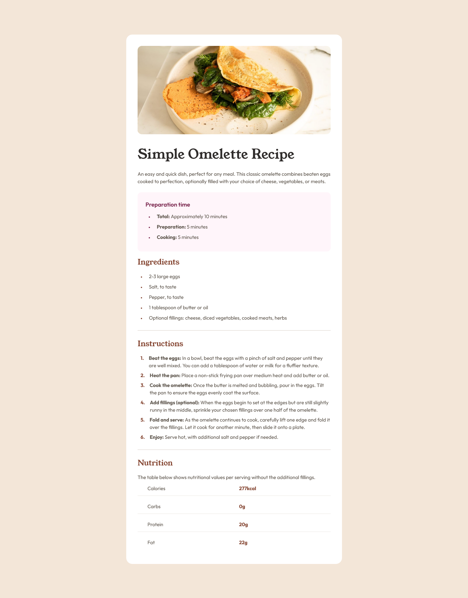
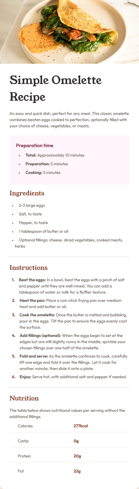

# Frontend Mentor - Recipe page solution

This is a solution to the [Recipe page challenge on Frontend Mentor](https://www.frontendmentor.io/challenges/recipe-page-KiTsR8QQKm). Frontend Mentor challenges help you improve your coding skills by building realistic projects.

## Table of contents

- [Overview](#overview)
  - [The challenge](#the-challenge)
  - [Screenshot](#screenshot)
  - [Links](#links)
- [My process](#my-process)

  - [Built with](#built-with)
  - [What I learned](#what-i-learned)

- [Author](#author)

## Overview

### Screenshot




### Links

- Solution URL: [GitHub](https://github.com/Ibtehaj-Ali-1/Recipe-Page)
- Live Site URL: [Recipe Page](https://recipe-page-pi-ashen.vercel.app/)

## My process

### Built with

- Semantic HTML5 markup
- CSS custom properties
- Flexbox
- CSS Grid
- Mobile-first workflow

### What I learned

- I learned a lot about lists.
- I learned how to use the CSS Grid property.
- I learned how to use the CSS Flex property.
- I learned how to use the CSS `::marker` selector.

<!-- Use this section to recap over some of your major learnings while working through this project. Writing these out and providing code samples of areas you want to highlight is a great way to reinforce your own knowledge.

To see how you can add code snippets, see below:

```html
<h1>Some HTML code I'm proud of</h1>
```

```css
.proud-of-this-css {
  color: papayawhip;
}
```

```js
const proudOfThisFunc = () => {
  console.log("🎉");
};
```

If you want more help with writing markdown, we'd recommend checking out [The Markdown Guide](https://www.markdownguide.org/) to learn more.

**Note: Delete this note and the content within this section and replace with your own learnings.** -->

## Author

- Website - [Ibtehaj Ali](https://github.com/Ibtehaj-Ali-1/Recipe-Page)
- Frontend Mentor - [@Ibtehaj-Ali-1](https://www.frontendmentor.io/profile/Ibtehaj-Ali-1)
